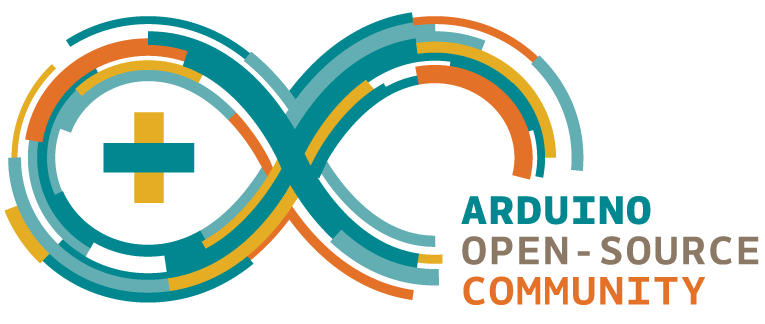

<!-- HEADINGS -->

# Mi titulo
## mi titulo h2
### mi titulo h3
#### mi titulo h4
##### mi titulo h5
###### mi titulo h6


Esto es un texto en *italic*

Esto es un texto en **negrilla**

<!-- UL -->
* apple
    * orange


[enphoria] (https://www.enphoria.net)

`console.log('hello world')`

```arduino

const int ledPIN = 9;
 
void setup() {
  Serial.begin(9600);    //iniciar puerto serie
  pinMode(ledPIN , OUTPUT);  //definir pin como salida
}
 
void loop(){
  digitalWrite(ledPIN , HIGH);   // poner el Pin en HIGH
  delay(1000);                   // esperar un segundo
  digitalWrite(ledPIN , LOW);    // poner el Pin en LOW
  delay(1000);                   // esperar un segundo
}
```

